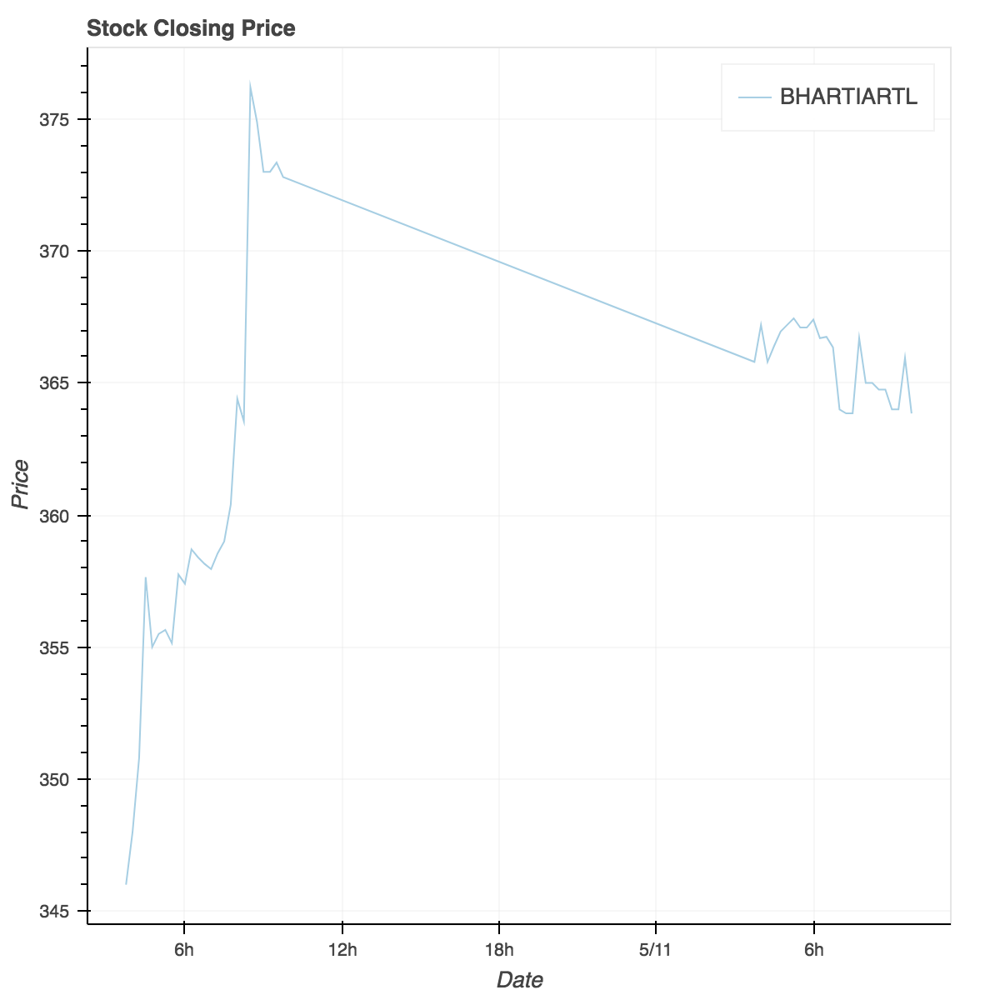

# kite-history
[](https://github.com/mr-karan/kiteHistory/blob/master/LICENSE)
[](https://saythanks.io/to/mr-karan)

`kitehistory` is a wrapper around [Kite Historical API](https://kite.trade/docs/connect/v1/#historical-data)


### Installation : 

    pip install kitehistory

[](https://asciinema.org/a/124280)

### Options : 

    --symbol                         Stock symbol of the instrument.
    --interval                       Time interval for the tick data.
    --from_date                      Start date indicating the start of records.
    --to_date                        End date indicating the end of records.
    --exchange                       Exchange Name. (MCX/NSE/BSE/NFO/CDS/BFO/MCXSX)
    --output                         Set flag to save data in csv format
    --plot                           Set flag to plot chart in html format
    --path                           Specify path to directory to store instruments master 
                                     along with access token keys
    --verbose                        Enable verbose logging

### Example Usage : 

    kitehistory -s TCS -i day -f 2017-05-15 -t 2017-06-05 -e NSE -o --plot 




### First Time Setup

`kitehistory` depends on Kite API to fetch instruments master file in `.csv`. You need to create an appllication at
[https://developers.kite.trade/apps](https://developers.kite.trade/apps) and export the following keys in your shell

```
            export KITE_API_KEY='your-kite-api-key'
            export KITE_SECRET='your-kite-secret-key'
            export KITE_REQUEST_TOKEN='your-kite-request-token'

``` 

### How it works ?

Kite API requires instrument-token to fetch the historical data. The idea behind this wrapper is to fetch the instruments
master file and query it for the required symbol to fetch instrument token. Once the token is fetched, it uses Kite's API
to get the historical data and saves the output in a `.csv` ready for analysis etc. 

## Credits

- [pandas](http://pandas.pydata.org/)
- [Kite API](https://developers.kite.trade/apps/)
- [pykiteconnect](https://kite.trade/docs/pykiteconnect/)
- [requests](http://docs.python-requests.org/en/master/)

## Contributing

Feel free to report any issues and/or send PRs for additional features.

### License

MIT © Karan Sharma 
[LICENSE included here](LICENSE)